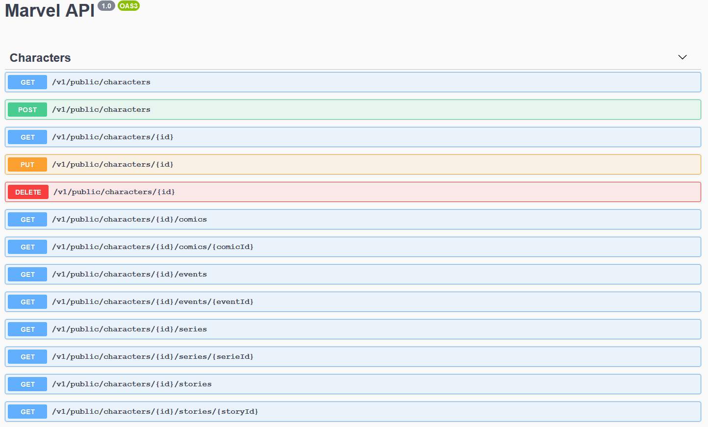

# Marvel API


```bash
  Swagger URL: http://localhost:3000/v1/public/docs
```

## Description

This app is an example of an Rest Aplication, based on the following Marvel API:
[Link](https://developer.marvel.com/docs#!/public)

Developed using the framework Nest to have a good archtecture and to facilicate futures updates.

In this app I decided to use sqlite3 as a database, to make it easier for anyone to test.

## Requirements
```bash
Node.js - latest
NPM - latest
```

## Installation

```bash
$ npm install
```

## Running the app

```bash
# development
$ npm run start

# watch mode
$ npm run start:dev

# production mode
$ npm run start:prod
```

## Running docker

```bash
# build image
$ docker build -t marvel-api .

# run container
$ docker run -p 3000:3000 --name marvel-api marvel-api
```

## Stay in touch

- [Github](https://github.com/armgalison/)
- [Linkedin](https://www.linkedin.com/in/armgalison/)

## License

  [MIT licensed](LICENSE)
